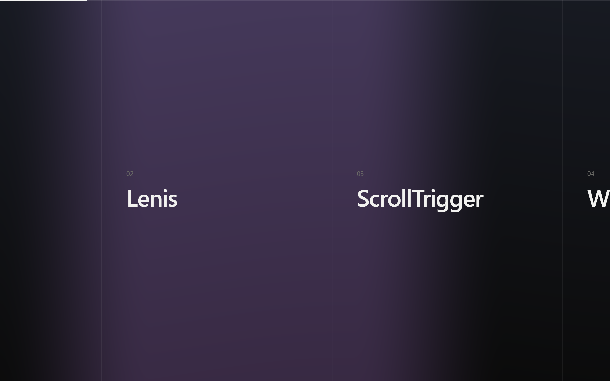

# lenis-webgl-ticker

Lenis smooth scrolling driven from the same `requestAnimationFrame` loop as Three.js and GSAP, so scroll position, tween state, and the rendered frame are always computed from the same value.



The demo's rail section, pinned at roughly half its scroll range. The background is a WebGL plane whose `uProgress` uniform is written during the same frame that positions the track.

## The problem

The usual Lenis setup gives it its own RAF:

```ts
function raf(time: number) {
  lenis.raf(time)
  requestAnimationFrame(raf)
}
requestAnimationFrame(raf)
```

Three.js (or React Three Fiber's internal loop) then registers a second RAF. Browser callback order is registration order, not causal order — so the renderer can draw a frame using the *previous* frame's scroll offset. That one-frame lag reads as tearing between DOM content and the WebGL layer, and it gets worse with every extra loop (GSAP's ticker is a third).

## The fix

One RAF owner, priority-ordered subscribers:

| Priority | Phase | Work |
| --- | --- | --- |
| `-100` | `SCROLL` | `lenis.raf(time)` writes the scroll position and emits `scroll` |
| `0` | `ANIMATION` | `gsap.updateRoot(time / 1000)` advances tweens and scrubs |
| `100` | `RENDER` | `advance()` renders the Three.js scene |

Anything needing per-frame work subscribes to the ticker rather than opening its own loop.

```ts
import { subscribe, TICK_PRIORITY } from '@/lib/ticker'

const unsubscribe = subscribe((time, deltaMs) => {
  // ...
}, TICK_PRIORITY.ANIMATION)
```

## Files

| Path | Role |
| --- | --- |
| `src/lib/ticker.ts` | Owns the only `requestAnimationFrame`; priority-ordered subscribers |
| `src/components/SmoothScroll.tsx` | Lenis instance + context; optional wrapper (`container`) mode |
| `src/lib/gsap-bridge.ts` | Detaches GSAP from its own ticker, wires ScrollTrigger, registers `scrollerProxy` |
| `src/lib/scroll-state.ts` | Mutable frame-local scroll values shared with the render phase |
| `src/components/Scene.tsx` | R3F canvas with `frameloop="never"`, driven by the ticker |
| `src/components/scene-vanilla.ts` | Same wiring for a raw `WebGLRenderer` |
| `src/app/page.tsx` | Demo: pinned hero, horizontal rail, card stack |

## Setup

```bash
npm install
npm run dev
```

Then open `http://localhost:3210`.

To regenerate the screenshot above, with the dev server running:

```bash
npm run screenshot
```

It drives a Chromium-based browser through `playwright-core`, which ships no browser of its own — the script looks for an installed Chrome or Edge, so set `BROWSER_PATH` if yours lives somewhere unusual. `SCREENSHOT_URL`, `SCREENSHOT_OUT`, `SCREENSHOT_SCROLL`, `SCREENSHOT_WIDTH`, and `SCREENSHOT_HEIGHT` override the rest.

## Configuration

```ts
new Lenis({
  duration: 1.2,
  easing: (t) => Math.min(1, 1.001 - Math.pow(2, -10 * t)),
  orientation: 'vertical',
  smoothWheel: true,
  syncTouch: false,
  autoRaf: false,
})
```

`autoRaf: false` is required — the ticker calls `lenis.raf` itself.

`smoothTouch` was removed in Lenis v1; the equivalent is `syncTouch`, which defaults to `false`. Leaving it off preserves native touch scrolling and momentum on mobile. Lenis still adopts the resulting native scroll position and re-emits it, so pins and shader uniforms stay driven on the touch path.

Measured against a real wheel burst, the easing above halves the remaining distance every ~100ms, matching the `1.2 / 10 = 120ms` half-life the curve predicts.

## Wrapper mode

By default Lenis scrolls the document. Pass `container` to scroll a fixed element instead:

```tsx
<SmoothScroll container>{children}</SmoothScroll>
```

This registers a `ScrollTrigger.scrollerProxy` so GSAP reads `lenis.scroll` rather than `wrapper.scrollTop`, and sets `ScrollTrigger.defaults({ scroller })` so individual triggers don't each need it.

Triggers created *before* the bridge mounts won't pick up that default. React runs layout effects child-first, so a page component's effect fires before the provider's. Gate on the context value:

```tsx
const lenis = useLenis()
useLayoutEffect(() => {
  if (!lenis) return
  // create ScrollTriggers here
}, [lenis])
```

## Passing scroll values to shaders

Per-frame values go through a plain mutable object, not React state — a state update per frame would re-render the tree at 60–120Hz and land a commit behind the frame that reads it.

```ts
// write, during ANIMATION
onUpdate: (st) => { scrollState.railProgress = st.progress }

// read, during RENDER
useFrame(() => {
  material.current.uniforms.uProgress.value = scrollState.railProgress
})
```

Because the store isn't React state, the canvas doesn't need to live inside the provider — it mounts as a sibling, outside the scroll container, where `position: fixed` is unambiguous.

## Gotchas

**Don't put a class name on the Lenis root element.** Lenis rewrites `className` on its root and strips anything matching `/lenis(-\w+)?/` during cleanup. A wrapper styled with `.lenis-wrapper` silently loses its class at runtime — it stops being `position: fixed; overflow-y: auto`, and the document scrolls instead of the container. Everything still *looks* plausible. Use data attributes (`[data-scroll-wrapper]`) instead.

**Detach GSAP from its own ticker**, or scrub tweens advance on a loop you don't control and land a frame off from the render:

```ts
gsap.ticker.remove(gsap.updateRoot)
gsap.ticker.lagSmoothing(0)
```

`lagSmoothing(0)` matters too — GSAP's frame-drop compensation would clamp deltas the ticker already measured.

**`pinType: 'transform'` is mandatory** for an element scroller. `position: fixed` doesn't escape an `overflow` container, so GSAP's default pinning silently detaches pins from the viewport.

**Pinned sections use `svh`, not `dvh`.** `dvh` tracks the mobile URL bar, so every pinned section resizes mid-scroll, firing `ScrollTrigger.refresh()` and jumping the pin. `svh` is stable, so pins measure once. Non-pinned sections can use `dvh` freely.

**`frameloop="never"` renders nothing until the first `advance()`.** `TickerDriver` forces one on canvas-size change so the canvas isn't blank before the first tick.

**`advance()` takes seconds, `lenis.raf()` takes milliseconds.** Passing the wrong unit to either silently breaks its internal delta.

## Version constraints

`@react-three/fiber@9` peer-requires `react >=19 <19.3`, so React is pinned to `19.2.0`. Installing the latest React fails dependency resolution.
